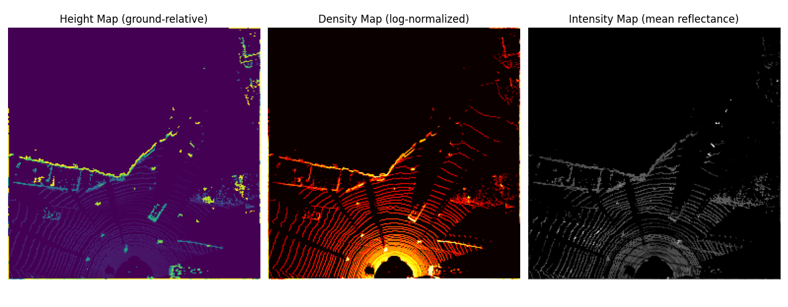

# Multi-Modal Perception: Camera + LiDAR (KITTI)

This repository implements a from-scratch BEV perception pipeline using LiDAR and camera data, inspired by modern autonomous driving systems.

The project incrementally builds:
1. BEV representations from raw LiDAR
2. Ground-truth detection targets from KITTI 3D labels
3. A BEV-based 3D object detector (upcoming)

---

## Project Roadmap
| Stage      | Description                             | Status |
| ---------- | --------------------------------------- | ------ |
| Part 1     | LiDAR loading, calibration, projections | ✅      |
| Part 2     | BEV feature encoding                    | ✅      |
| **Part 3** | **BEV labels & detection targets**      | ✅      |
| Part 4     | BEV CNN backbone                        | ⏳      |
| Part 5     | Detection head + losses                 | ⏳      |
| Part 6     | Inference & visualization               | ⏳      |

---

## Dataset
- KITTI Tracking Dataset
- Modalities:
    - Velodyne LiDAR
    - RGB camera
    - Calibration files
    - 3D tracking annotations

---

## BEV Representation (LiDAR -> Grid)
The BEV encodes LiDAR data into a grid-based tensor suitable for detection and tracking models. Each BEV cell aggregates points falling within a fixed spatial region.
**Channels**
- **Height**: Max ground-normalized height per cell (highlights object structure)
- **Density**: Log-normalized point count (captures occupancy and vertical surfaces)
- **Intensity**: Mean LiDAR reflectance (reflects material and surface properties)

**Coordinate Convention**
- X: forward
- Y: lateral
- Z: up
- Ego vehicle located at bottom-center of BEV

Below is an example of the BEV feature channels constructed from LiDAR data.


---

## BEV Detection Targets
- Label Processing
    - KITTI tracking labels parsed per frame, objects filtered by class
    - 3D bounding boxes converted to BEV boxes `(x, y, w, l, yaw)`
- BEV Ground-Truth
    - Rotated BEV box visualization
    - Coordinate transform from LiDAR frame -> BEV plane
- Detection Targets (Anchor-Free)
Inspired by CenterNet / CenterPoint-style detectors:
    - Center heatmap (object presence)
    - Box size regression (width, length)
    - Orientation regression (yaw)

---

## Code Structure

```
multimodal-perception-camera-lidar/
├── data/                 # KITTI tracking data
├── dataset/KITTI/        # Dataset loaders & label parsing
├── bev/                  # BEV utilities & encoders
├── visualization/        # BEV & camera visualizations
├── models/               # BEV backbone & detection head (WIP)
├── training/             # Losses & training loop (WIP)
├── notes/                # Conceptual notes
├── test/                 # Sanity tests & visual checks
└── README.md
```

---

## Setup
```bash
python3 -m venv .venv
source .venv/bin/activate
pip install -r requirements.txt
```
